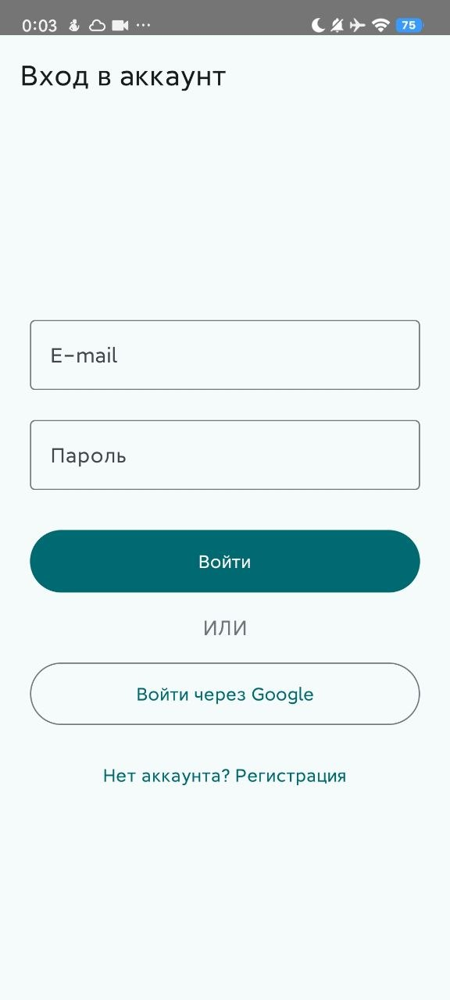
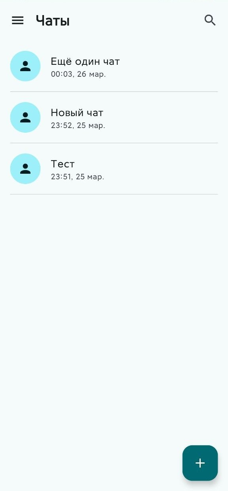
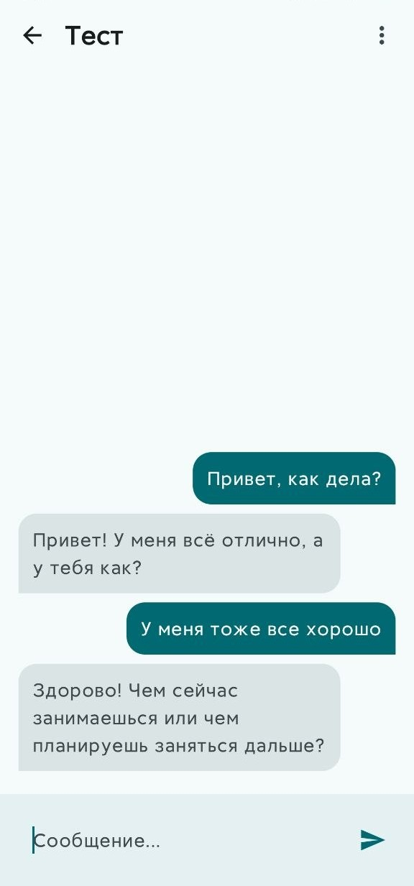
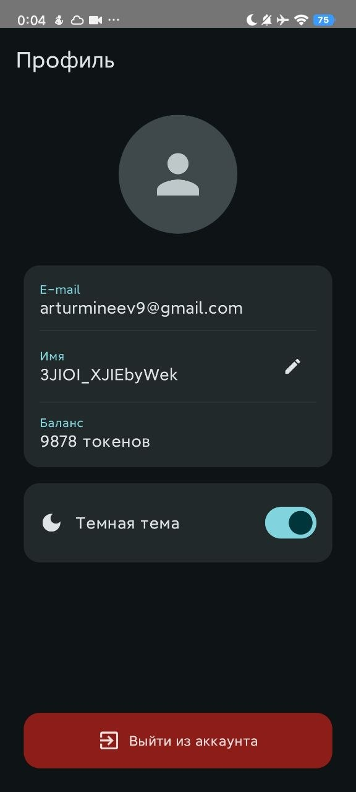
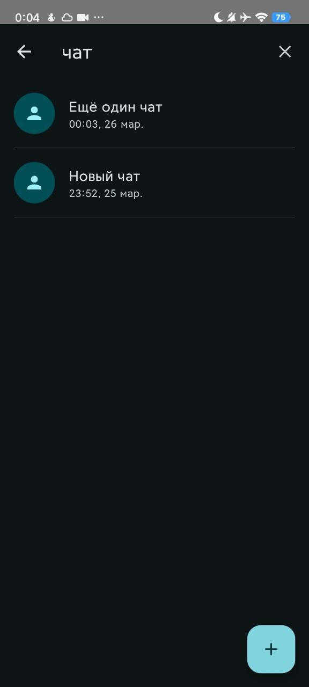
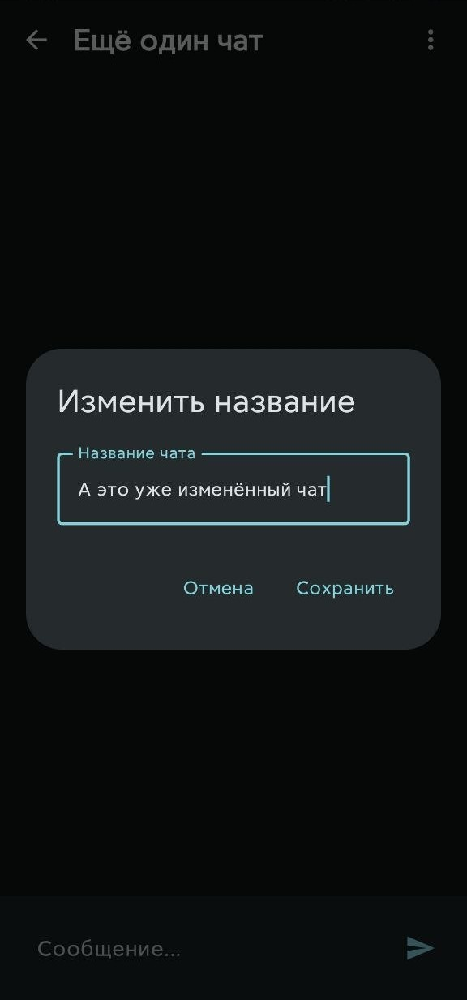

# Avito Trainee Assignment

Android-приложение AI-ассистента, выполненное в рамках тестового задания.

Приложение позволяет:
- авторизоваться по email/password и через Google;
- создавать и искать чаты;
- общаться с ИИ;
- редактировать профиль, менять тему и аватар.

## Демонстрация

### Скриншоты

  
  
  

  
  
  

### Скринкаст

[Смотреть видео-демонстрацию (Яндекс Диск)](https://disk.360.yandex.ru/i/4V7iuVpwl2BorQ)

## Функциональность

### Авторизация
- Вход по email/password.
- Регистрация нового пользователя.
- Вход через Google Sign-In.
- Обработка ошибок авторизации.

### Чаты
- Создание нового чата.
- Отображение списка чатов с пагинацией.
- Поиск по названиям чатов.
- Navigation Drawer для навигации по разделам.

### Диалог с ИИ
- Отправка сообщений в чат.
- Отображение истории сообщений.
- Переименование чата.
- Обработка сетевых и серверных ошибок.
- Учет токенов пользователя.

### Профиль
- Отображение данных пользователя.
- Смена имени.
- Загрузка локального аватара.
- Переключение светлой/темной темы.
- Выход из аккаунта.

## Технологии

- Kotlin
- Jetpack Compose
- MVI
- Clean Architecture
- Hilt
- Room
- Paging 3
- Kotlin Coroutines + Flow
- DataStore
- Firebase Authentication
- Retrofit + OkHttp
- GigaChat API
- Coil

## Архитектура

Проект построен в многомодульном формате.

### Модули
- `app` — точка входа в приложение.
- `core` — общие зависимости, navigation, database, network, ui, datastore.
- `feature:auth` — авторизация.
- `feature:chats` — список чатов и поиск.
- `feature:chat` — экран отдельного чата.
- `feature:profile` — профиль пользователя.

### Подход
- `api` модуль содержит контракты, модели и use case интерфейсы.
- `impl` модуль содержит реализацию data/domain/presentation слоев.
- UI построен на MVI-подходе: `State + Event + Effect`.

## Запуск проекта

### Перед запуском
1. Добавить `google-services.json` в модуль `app`.
2. Указать необходимые значения в `local.properties`:
   - `GIGACHAT_AUTH_KEY`
   - `GIGACHAT_AUTH_BASE_URL`
   - `GIGACHAT_API_BASE_URL`

[Ссылка на файлы (Яндекс Диск)](https://disk.360.yandex.ru/d/NCcPrTVTblF30Q)
